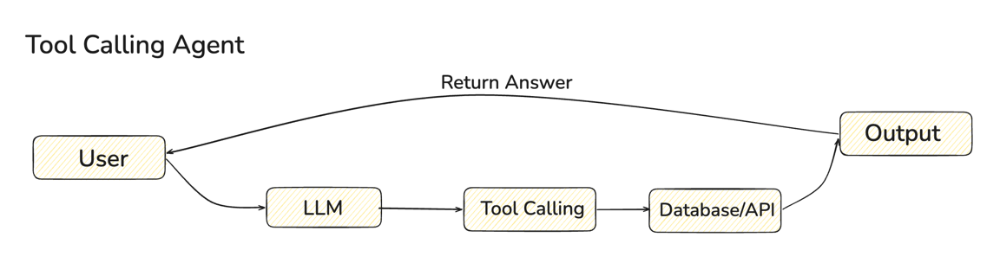
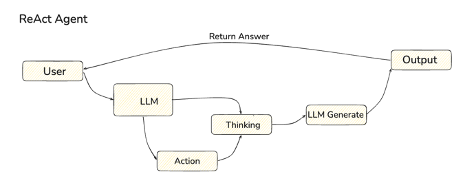
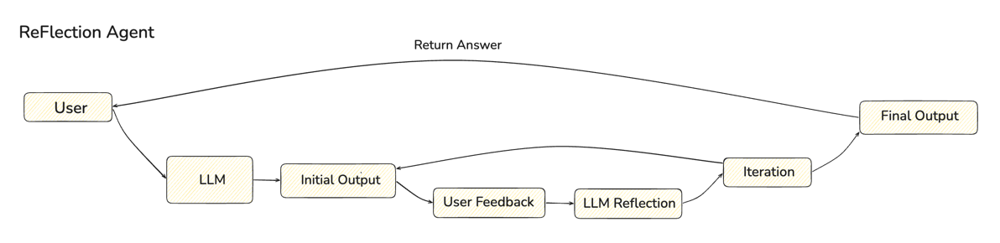
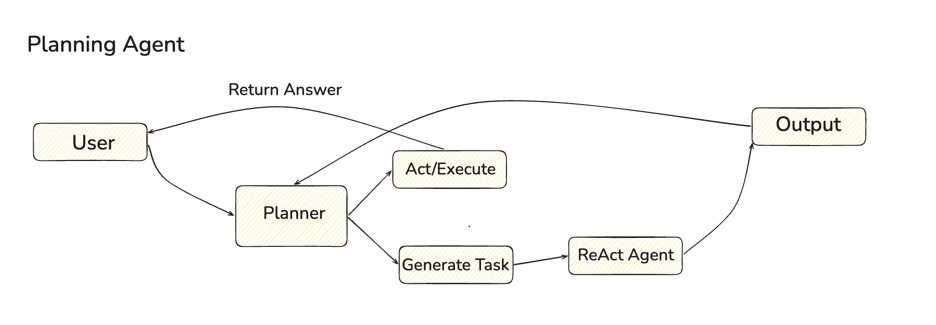
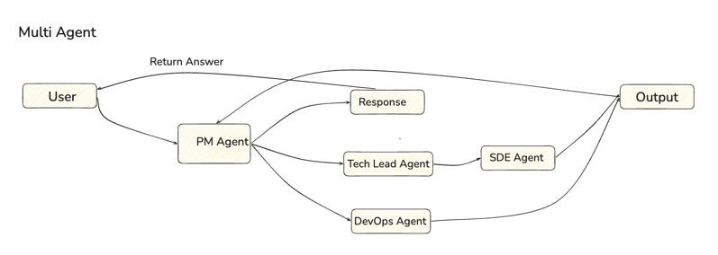

# AI Agents

Agent loops on local Ollama (`qwen2.5:7b`).

```
tool_use_agent.py      tool calling
ReAct_agent.py         thought / action / observation
ReFlection_agent.py    generate / critique / revise
planning_agent.py      plan, then execute
multi_agent.py         specialists in parallel
```

## tool_use_agent.py

`create_agent` with `@tool`. The model calls a function when it needs one. Tools are `multiply` and `search_weather`; the docstring is the schema.

<p></p>

## ReAct_agent.py

Explicit ReAct loop. The graph alternates `reason` and `act` until `Final Answer`.

```
Thought → Action → Action Input → Observation
```

`Observation` is injected by the runtime. The model is stopped before that token so it cannot invent a tool result. One action per turn.

<p></p>

## ReFlection_agent.py

Generator and critic are separate nodes.

```
generate → reflect → generate → …
```

The critic returns `REVISE` or `APPROVE` and does not rewrite the draft. The loop ends on `APPROVE` or when `MAX_ITERATIONS` is reached.

<p></p>

## planning_agent.py

Plan-and-execute. A planner turns the request into a task list. An executor then runs each task with tools, in order.

```
request → plan → task_1 → task_2 → …
```

<p></p>

## multi_agent.py

A math agent (`multiply`, `add`) and an info agent (`search_weather`, `get_current_date`) start together. The coordinator waits for both results and writes a single reply.

```
START → math_specialist ┐
      → info_specialist ┘ → summarize → END
```

Each node updates only its own state keys.

<p></p>
